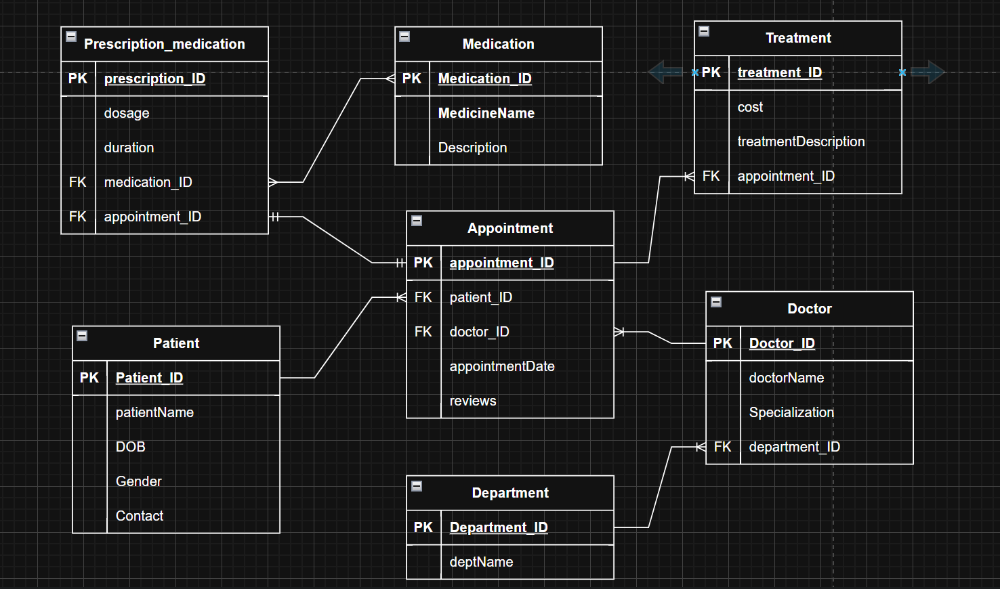

# myClinic Database (Clinic Booking System)

---

## Description 

The myClinic Database System is  designed to manage and streamline operations within a medical clinic.

It supports booking and managing appointments :
- Between patients and doctors
- Tracking medical treatments
- Handling prescriptions and
- Organizing clinic departments and medications.

---

## Tables 

1. Patient - has details about the patient

2. Medication -contains medication details

3. Department - different departments in the clinic

4. Doctor - details about the doctors and their specializations

5. Appointment - contains appointment details, including dates

6. Treatment - types of treatment for different diseases and costs

7. Prescription_Medication - contains prescription

---

## How to run/setup the project (or import SQL)
### Prerequisites
- A SQL database server:

a. MySQL.

- A database client tool:

e.g., MySQL Workbench, 

- Basic knowledge of SQL commands

### Step-by-Step Setup Guide
#### Step 1: Install Database Server
If you don’t have a database server installed then download and install:

#### Step 2: Launch Your SQL Client
Use any SQL client tool to connect to your database server. Create a new database:

CREATE DATABASE clinic_booking;
USE clinic_booking;

#### Step 3: Create the Tables

Create all the tables

---

## ERD

[Link](https://app.diagrams.net/#G1Z0J3O5c7CJq4eHo_eyElPhgK6KA0gdsJ#%7B%22pageId%22%3A%22aqFZoREJnGYSpuJXvaab%22%7D)

